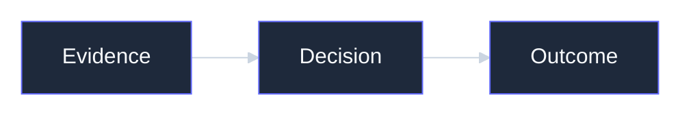

# Fmind Visual Theme

The brand tokens live in [SKILL.md](SKILL.md) and [www.fmind.dev](https://www.fmind.dev/). Use these snippets when a renderer needs the theme in its own syntax.

Use generous space, crisp geometry, restrained indigo, and evidence-led labels. Avoid gradients, decorative illustration, generic AI imagery, and dense dashboards unless the content requires them.

## Brand Palettes

### Fmind (Articles & Documents)

Calm, exact, spacious, technically grounded. Crisp geometry and editable diagrams over decorative imagery.

| Token | Value | Token | Value |
| --- | --- | --- | --- |
| Background | `#0F172A` | Muted | `#CBD5E1` |
| Panel | `#1E293B` | Primary | `#646CFF` |
| Foreground | `#F8FAFC` | Border | `#334155` |

Headings in Outfit (Variable), body in Inter (Variable).

### Bleeding Agent (Media & Podcast)

Forensic, sharp, darkly playful. Cyan, magenta, and red diagnostics; black-box imagery, terminal texture, warning marks, protocol traces, failure boundaries.

| Token | Value | Token | Value |
| --- | --- | --- | --- |
| Background | `#061321` | Cyan | `#00E5FF` |
| Panel | `#0B2034` | Magenta | `#FF2AA1` |
| Foreground | `#F7FAFC` | Red | `#FF3158` |
| Muted | `#A7BBCB` | Border | `#16364F` |

## Portable Mermaid Frontmatter

Use Mermaid's `base` theme because it is the customizable theme. This form stays inside the Mermaid source and can be used in `.mmd`, GitHub fences, and Slidev fences when the target Mermaid version supports frontmatter.

For a renderer that does not support Mermaid frontmatter, move the same configuration into its supported site-level Mermaid configuration instead of falling back to unthemed output.

Keep Mermaid on the root-level system sans stack even when the surrounding deck uses Inter: setting the root `fontFamily` before layout keeps label measurements stable without changing Slidev's HTML-label layout mode.

## LikeC4

Define Fmind colors as named tokens inside the LikeC4 `specification` block, then use those tokens in styles. Do not scatter raw hex values across views.

## D2

An Fmind article diagram imports [diagram.d2](references/diagram.d2) and uses its classes on a light surface. The diagram surface stays light because the site renders in reader-toggled light and dark themes; a light figure reads as a panel on dark theme, while a dark figure reads as a hole punched in light theme.

| Class | Means |
| --- | --- |
| `group` | A labelled boundary holding other shapes |
| `container` | A major building block the article names |
| `component` | A leaf part inside a container |
| `actor` | A human or calling system: where the flow enters |
| `external` | Something outside the boundary being described |
| `step` | One numbered stage of a sequence |
| `terminal` | Where a flow starts or stops |

Elsewhere, start from a built-in D2 theme and use `theme-overrides` or `dark-theme-overrides` under `vars.d2-config`, and supply all eight `--font-*` flags together with copied Inter TTF files when exact font rendering matters.
