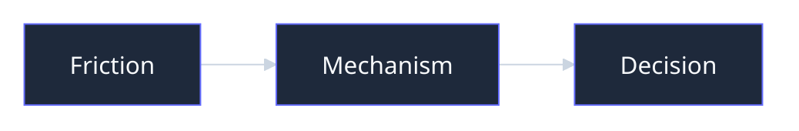

# Presentation title

## One concrete tension, decision, or mechanism

  Médéric Hurier · www.fmind.dev

<!--
State the audience, why this matters now, and the single takeaway.
-->

---
layout: default
---

# One idea per slide

- Start from concrete friction.
- Show the mechanism or evidence.
- End with a decision boundary.

---
layout: default
---

# Portable diagrams use Mermaid

---
layout: end
---

# The useful next move

www.fmind.dev
