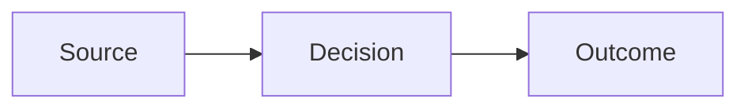

# Mermaid Diagram Standard

Mermaid is the default diagram format because the same editable text can render directly in GitHub Markdown and inside Slidev decks. Keep the source portable, reviewable, and close to the prose it explains.

## Decision Boundary

- Use Mermaid for flowcharts, sequences, states, classes, entity relationships, timelines, mind maps, Git graphs, and other compact technical visuals.
- Use [LikeC4](../likec4-dsl/SKILL.md) instead when the architecture model is the durable source of truth and must generate multiple consistent views.
- Use [D2](../d2/SKILL.md) instead for an existing D2 codebase or a bespoke standalone composition that Mermaid cannot express clearly.
- Omit the diagram when prose, code, a short list, or a table communicates the point more directly.

## Workflow

1. State one visual thesis and the reader decision it supports.
1. Choose the simplest stable diagram type supported by every target renderer. Prefer `flowchart`, `sequenceDiagram`, `stateDiagram-v2`, `classDiagram`, and `erDiagram` for GitHub and Slidev portability.
1. Write the editable source as a fenced `mermaid` block when it belongs to one Markdown document, or as a `.mmd` file when it is reused or rendered independently.
1. Keep labels short, relationships explicit, direction intentional, and the node count small enough to read without zooming.
1. Use Mermaid frontmatter for configuration. Do not add deprecated `%%{init: ...}%%` directives to new diagrams.
1. Apply the Fmind theme from [fmind-theme](../fmind-visuals/references/fmind-theme.md) when the work represents Médéric or `www.fmind.dev`.
1. Validate and render locally:

   ```bash
   mmdc -i diagram.mmd -o diagram.svg -b transparent
   ```

1. Inspect the actual render for clipping, line crossings, contrast, spelling, label density, and mobile or slide readability.
1. Keep the Mermaid source. Add SVG by default only when the target cannot render Mermaid; add PNG only when a platform requires raster output.

## Portable Embedding

GitHub and Slidev both render standard fenced Mermaid:

````md

````

For a diagram targeting both systems:

- Put Mermaid configuration inside diagram frontmatter rather than using Slidev-only fence options.
- Avoid a newly released diagram type until the target renderer's Mermaid version supports it. GitHub exposes its current version through a Mermaid block containing `info`.
- Keep remote images, custom JavaScript, click callbacks, and renderer-specific plugins out of the portable source.
- Treat the rendered diagram as potentially inaccessible: add surrounding prose or alt text that communicates the same essential conclusion.

## Quality Rules

- A diagram is an argument, not decoration. Every node and edge must earn its place.
- Preserve source terminology and evidence boundaries. Never invent metrics, components, trust boundaries, or causal relationships.
- Prefer a left-to-right flow for slide-sized processes and top-to-bottom for document-sized hierarchies.
- Split a dense diagram into views instead of shrinking labels.
- Set a renderer-stable system stack through root-level `config.fontFamily`. Diagram-specific `flowchart.htmlLabels` is deprecated, and late-loading web fonts can clip labels inside fixed bounds.
- Use `accTitle` and `accDescr` when the selected diagram type and target renderer support them.

## Official References

- [Mermaid syntax reference](https://mermaid.js.org/intro/syntax-reference.html)
- [Mermaid configuration](https://mermaid.js.org/config/configuration.html)
- [Mermaid theme variables](https://mermaid.js.org/config/theming)
- [Mermaid configuration schema](https://mermaid.js.org/config/schema-docs/config.html)
- [Mermaid CLI](https://github.com/mermaid-js/mermaid-cli)
- [GitHub Mermaid diagrams](https://docs.github.com/en/get-started/writing-on-github/working-with-advanced-formatting/creating-diagrams)
- [Slidev Mermaid support](https://sli.dev/features/mermaid)
